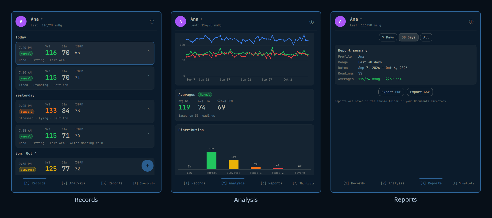

# Tensio for Omarchy

A blood-pressure log in your Omarchy bar. Tensio is a desktop port of the Tensio iOS app: log readings for several people, see each reading's American Heart Association (AHA) category, review trends, and export PDF or CSV reports. Everything stays on your machine; the plugin makes no network requests.



## Quick path

1. Add the plugin and enable it in the bar:

   ```bash
   omarchy plugin add https://github.com/juancasanueva/omarchy-tensio --enable
   ```

   Or add it first and enable it later, choosing a bar section:

   ```bash
   omarchy plugin add https://github.com/juancasanueva/omarchy-tensio
   omarchy plugin enable io.github.juancasanueva.tensio --section right
   ```

2. Click the heart in the bar, create a profile, and press **+** to log the first reading.
3. The bar now shows the active profile's last reading, coloured by its category.

## Features

| Area | What you get |
|------|--------------|
| Bar | Heart icon plus the active profile's last reading (`SYS/DIA`), coloured by category. Click to open the panel. |
| Profiles | Up to 20 profiles, each with its own readings. Add, rename, delete and switch from the header menu. |
| Records | Readings grouped by day, newest first (the 200 most recent are listed; CSV export holds the full log). Add, edit and delete readings. |
| Reading fields | Systolic, diastolic, pulse, date, time, feeling, body position, arm, note (up to 200 characters). |
| Analysis | SYS / DIA / PULSE line chart, averages card with category badge, and category distribution, over 7 days, 30 days or all readings. |
| Reports | Summary for the chosen range and export to PDF or CSV, with **Open** and **Open folder** buttons. |
| Info | Category table, emergency warning and medical disclaimer (the **i** button in the header). |

Accepted values: systolic 50–250, diastolic 30–150, pulse 30–220. Up to 20,000 readings in total.

## Blood-pressure categories

Rules are checked from Severe down to Elevated and the first match wins; Low applies only when none of those match.

| Category | Rule (mmHg) |
|----------|-------------|
| Low | SYS < 90 or DIA < 60 |
| Normal | SYS 90–119 and DIA 60–79 |
| Elevated | SYS 120–129 and DIA < 80 |
| Stage 1 Hypertension | SYS 130–139 or DIA 80–89 |
| Stage 2 Hypertension | SYS ≥ 140 or DIA ≥ 90 |
| Severe Hypertension | SYS > 180 and/or DIA > 120 |

Categories follow the AHA table, plus a Low band below 90/60.

## Keyboard and IPC

Everything in the panel works without the mouse. Press `?` in the panel for the same list. Single-letter keys are ignored while a text field has focus, so typing a note never triggers a shortcut.

### Global

| Keys | Action |
|------|--------|
| `1` `2` `3` or `Left` / `Right` | Switch between Records, Analysis and Reports |
| `n` or `+` | New reading |
| `p` | Open the profile menu |
| `[` / `]` | Previous / next profile |
| `i` | Category information |
| `?` | Show or hide this shortcut list |
| `w` / `m` / `a` | Range 7 days / 30 days / all (Analysis and Reports) |
| `Esc` | Close the topmost layer, otherwise the panel |

### Records

| Keys | Action |
|------|--------|
| `j` / `k` or `Down` / `Up` | Select the next / previous reading |
| `g` / `G` or `Home` / `End` | Select the first / last reading |
| `PageUp` / `PageDown` | Move the selection by a page |
| `Enter` or `e` | Edit the selected reading |
| `x` or `Delete` | Delete the selected reading (asks first) |

### Analysis, info and help

| Keys | Action |
|------|--------|
| `j` / `k` or `Down` / `Up` | Scroll |
| `PageUp` / `PageDown` | Scroll by a page |

### Reports

| Keys | Action |
|------|--------|
| `e` | Export PDF |
| `c` | Export CSV |
| `o` | Open the last export |
| `f` | Open the folder of the last export |

### Profile menu

| Keys | Action |
|------|--------|
| `j` / `k` or `Down` / `Up` | Move through the menu |
| `Enter` | Select the highlighted profile or action |
| `a` / `r` / `d` | Add / rename / delete profile |
| `p` or `Esc` | Close the menu |

### Reading form

| Keys | Action |
|------|--------|
| `Tab` / `Shift+Tab` | Next / previous field |
| `Up` / `Down` or `PageUp` / `PageDown` | Adjust SYS, DIA or pulse by 1 / 10 |
| `Space` or `Enter` | Open a dropdown or press the focused button |
| `Ctrl+Enter` or `Ctrl+S` | Save from any field |
| `Esc` | Cancel |

### Dialogs

| Keys | Action |
|------|--------|
| `Enter` or `y` | Confirm (Left / Right picks the button Enter presses) |
| `Esc` or `n` | Cancel a confirmation |
| `Enter` / `Esc` | Save / cancel a profile name |

Keyboard focus is always visible: the selected reading and the highlighted menu row get an accent border, and form fields and buttons show the focus ring.

Toggle the panel from a keybinding or script:

```bash
omarchy-shell shell toggle io.github.juancasanueva.tensio
```

To bind it in Omarchy, add a line like this to `~/.config/hypr/bindings.lua` (pick a key combination that is still free on your system); Tensio never edits that file itself:

```lua
o.bind("SUPER + CTRL + ALT + H", "Tensio", "omarchy-shell shell toggle io.github.juancasanueva.tensio")
```

## Privacy and files

> **No network access.** Tensio opens no sockets, fetches no URLs and loads no remote images. Every text item renders as plain text, so stored names and notes are never interpreted as markup.

| What | Where | Permissions |
|------|-------|-------------|
| State (profiles and readings) | `$XDG_STATE_HOME/tensio/state.json`, default `~/.local/state/tensio/state.json` | File `0600` in a `0700` directory |
| Exports | `<Documents>/Tensio/Tensio-<profile>-<YYYYMMDD-HHMM>.pdf` or `.csv` | Files `0600`; a newly created `Tensio` folder is `0700` |

- **Documents folder**: `$XDG_DOCUMENTS_DIR`, then `XDG_DOCUMENTS_DIR` from `~/.config/user-dirs.dirs`, then `~/Documents` if it exists, otherwise your home directory.
- **Exports never overwrite**: a second export in the same minute gets a `-2`, `-3`, … suffix. An export that fails while writing is removed.
- **State writes are atomic**: a temporary file in the state directory is renamed over `state.json`. The state file is capped at 4 MiB and validated on every load and save; a state file Tensio cannot read is reported and never overwritten.
- **Symlinks are refused** for the state directory, the state file and the `Tensio` export folder.
- **CSV cells** that start with `=`, `+`, `-` or `@` are prefixed with `'` so spreadsheets do not run them as formulas.

The plugin starts only these processes, always as argument lists without a shell:

| Process | When |
|---------|------|
| `/usr/bin/python3 -I -S <plugin>/bin/tensio_store.py load\|save\|export` | Loading, saving and exporting. Runs with a cleared environment (only `HOME`, the `XDG_*` locations, a fixed `PATH` and `LANG`), a deadline and bounded output. |
| `/usr/bin/xdg-open <file>` or `<folder>` | Only when you press **Open** or **Open folder** for the file the plugin just exported. |

## Removing

```bash
omarchy plugin remove io.github.juancasanueva.tensio
```

This disables the widget and deletes the plugin folder (`~/.config/omarchy/plugins/io.github.juancasanueva.tensio`). Your data is kept:

| Survives removal | How to delete it manually |
|------------------|---------------------------|
| `~/.local/state/tensio/state.json` (or under `$XDG_STATE_HOME`) | `rm ~/.local/state/tensio/state.json` then `rmdir ~/.local/state/tensio` |
| Exported reports in `<Documents>/Tensio/` | Delete the reports you no longer need from a file manager, then `rmdir` the empty folder |

Tensio installs no services, timers, hooks or packages, so nothing else remains.

## Development

Requirements: Omarchy 4 shell (Quickshell), `/usr/bin/python3` (standard library only), Node.js for the model tests.

```bash
node tests/test_model.cjs                       # domain model (categories, ranges, averages, validation)
/usr/bin/python3 -m unittest discover -s tests  # store helper and PDF writer
omarchy plugin validate .                       # manifest schema check
```

| Path | Role |
|------|------|
| `Panel.qml` | Bar button, panel, state and helper calls |
| `components/` | Pages, charts, form and dialogs |
| `Model.js` | Pure domain logic shared by the panel and the tests |
| `bin/tensio_store.py` | Load, save and export helper |
| `bin/tensio_pdf.py` | Dependency-free PDF report writer |

## Medical disclaimer

Tensio does not measure blood pressure and is not a medical device. Always check with your doctor before making medical decisions.

If a reading is in the Severe range and you have symptoms (chest pain, shortness of breath, back pain, numbness, weakness, change in vision or difficulty speaking), call emergency services.

## License

MIT. See [LICENSE](LICENSE).
